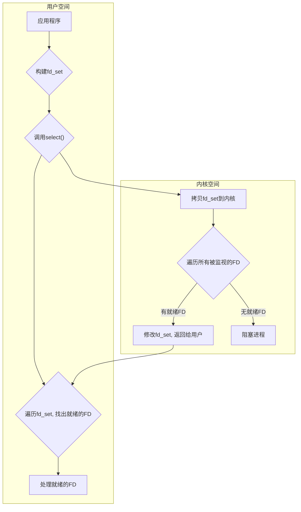
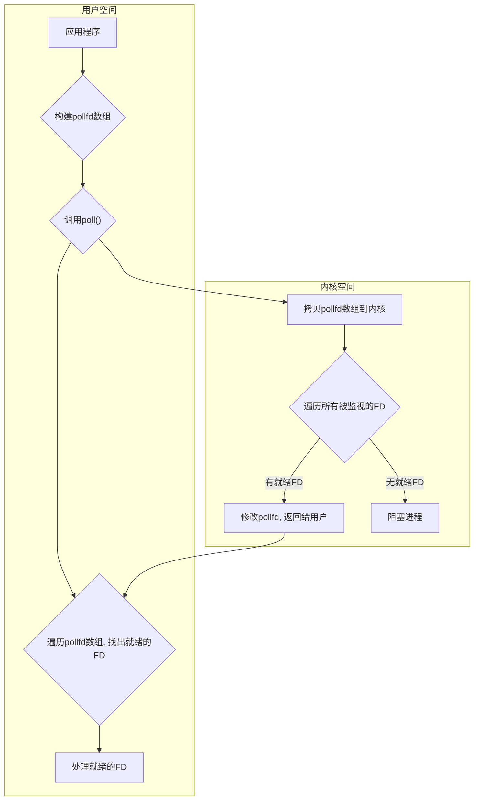
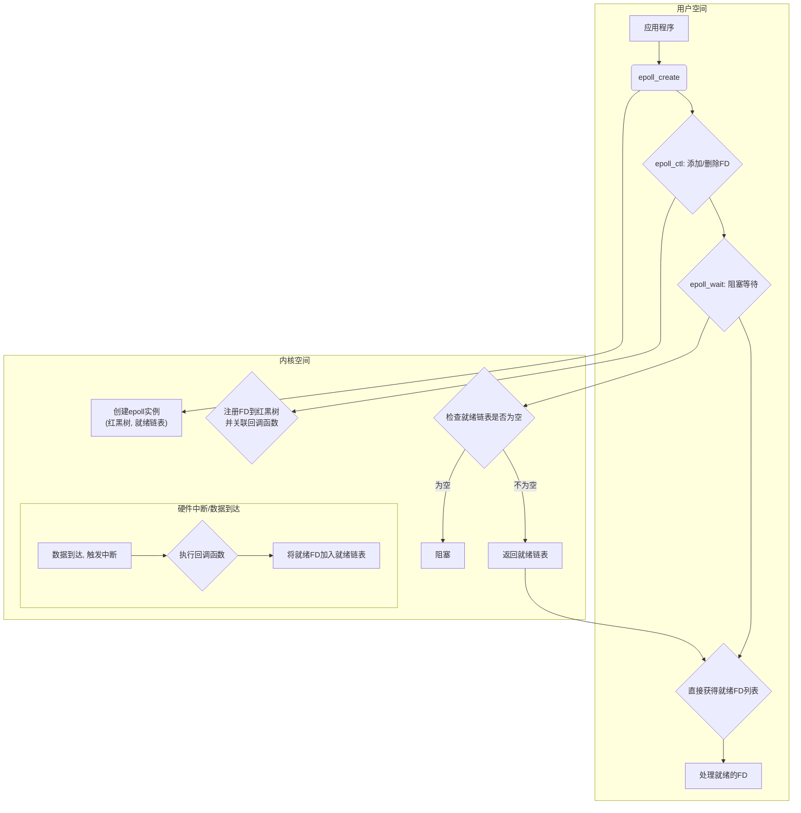

# 第4天: 操作系统与I/O模型

## 学习目标

- **学习Linux的五种I/O模型**: 理解阻塞I/O、非阻塞I/O、I/O多路复用、信号驱动I/O和异步I/O的工作原理。
- **重点理解`epoll`的优势**: 掌握`select`, `poll`, `epoll`之间的区别，并能阐述`epoll`为何在高性能网络编程中成为首选。

---

## 预备知识: 用户空间与内核空间

在理解I/O模型前，必须先了解两个基本概念：

- **用户空间 (User Space)**: 应用程序运行的地方。
- **内核空间 (Kernel Space)**: 操作系统内核运行的地方，拥有访问硬件（如网卡、磁盘）的权限。

当应用程序需要执行I/O操作（如读取网络数据）时，它不能直接操作硬件，必须通过**系统调用 (System Call)** 向内核发出请求。这个过程会涉及从用户空间到内核空间的状态切换。

一次I/O操作通常包含两个阶段：
1.  **等待数据准备好**: 等待网络数据包到达网卡并被拷贝到内核缓冲区。
2.  **将数据从内核拷贝到用户空间**: 将内核缓冲区的数据拷贝到应用程序指定的内存地址。

不同的I/O模型，主要区别就在于处理这两个阶段的方式不同，特别是第一阶段。

---

## Linux的五种I/O模型

### 1. 阻塞I/O (Blocking I/O)

这是最简单、最常见的I/O模型。当应用程序发起一个I/O操作（如`recvfrom`），它会一直被**阻塞**，直到**两个阶段全部完成**（数据准备好并从内核拷贝到用户空间）。

```mermaid
sequenceDiagram
    participant App as 应用程序
    participant Kernel as 内核
    App->>Kernel: 发起recvfrom系统调用
    note right of Kernel: 内核开始准备数据...
    Kernel-->>App: (阻塞)
    note left of App: 进程被挂起，无法执行其他任务
    ...数据准备完成...
    Kernel->>Kernel: 将数据从内核空间拷贝到用户空间
    Kernel-->>App: 返回成功响应
    App->>App: 处理数据
```

- **优点**: 简单易用。
- **缺点**: 一个线程在等待I/O时完全被阻塞，无法做任何其他事情，资源利用率低。

### 2. 非阻塞I/O (Non-blocking I/O)

当应用程序发起I/O操作时，如果数据还没准备好，内核会**立即返回一个错误码** (如`EWOULDBLOCK`)，而不是让应用阻塞。应用程序需要不断地**轮询 (Polling)** 内核，看数据是否准备好。

```mermaid
sequenceDiagram
    participant App as 应用程序
    participant Kernel as 内核
    loop 轮询检查
        App->>Kernel: 发起recvfrom系统调用
        alt 数据未准备好
            Kernel-->>App: 返回EWOULDBLOCK错误
            App->>App: (继续执行其他任务)
        else 数据已准备好
            Kernel->>Kernel: 将数据从内核拷贝到用户空间
            Kernel-->>App: 返回成功响应
            break
        end
    end
    App->>App: 处理数据
```

- **优点**: 不会阻塞线程，可以"同时"处理其他任务。
- **缺点**: 轮询会大量消耗CPU资源。

### 3. I/O多路复用 (I/O Multiplexing)

这是解决BIO和NIO问题的关键。它允许一个进程**同时监视多个I/O描述符 (file descriptors, FD)**。进程会被阻塞在`select`、`poll`或`epoll`这些系统调用上，直到至少有一个FD准备就绪。

这个模型解决了BIO一个线程只能处理一个连接的问题，也解决了NIO需要轮询消耗CPU的问题。它"阻塞"的不是某个具体的I/O操作，而是"监视"这个动作。

**模型核心**:
- **第一阶段**: 使用`select`/`poll`/`epoll`等待数据，这个过程是阻塞的。
- **第二阶段**: 当`select`返回有数据可读时，再调用`recvfrom`等实际I/O操作将数据从内核拷贝到用户空间，这个过程仍然是阻塞的。

所以，I/O多路复用在某些语境下也被认为是**同步阻塞I/O**的一种。

### 4. 信号驱动I/O (Signal-driven I/O)

应用进程发起I/O请求后，可以继续执行其他任务。当数据准备好时，内核会给该进程发送一个**信号 (Signal)**，进程收到信号后，在信号处理函数中调用I/O操作来读取数据。

```mermaid
sequenceDiagram
    participant App as 应用程序
    participant Kernel as 内核
    App->>Kernel: sigaction系统调用，注册信号处理函数
    App->>Kernel: 发起recvfrom系统调用 (立即返回)
    App->>App: (继续执行其他任务)
    ...数据准备完成...
    Kernel-->>App: 发送SIGIO信号
    App->>App: 信号处理函数被调用
    App->>Kernel: 在处理函数中发起recvfrom
    Kernel->>Kernel: 将数据从内核拷贝到用户空间
    Kernel-->>App: 返回成功响应
    App->>App: 处理数据
```

- **优点**: 避免了轮询，CPU利用率高。
- **缺点**: 编程复杂，且对于TCP协议，信号信息不够精确（比如可能同时有多个事件发生）。

### 5. 异步I/O (Asynchronous I/O - AIO)

这是最理想的I/O模型，完全符合"异步"的定义。应用发起`aio_read`等操作后立即返回，可以做任何其他事。内核会**独立完成两个阶段的所有工作**（等待数据和拷贝数据）。操作完成后，内核会通知应用程序（通过信号或回调函数）。

```mermaid
sequenceDiagram
    participant App as 应用程序
    participant Kernel as 内核
    App->>Kernel: 发起aio_read系统调用 (立即返回)
    App->>App: (继续执行其他任务)
    ...数据准备且拷贝完成...
    Kernel->>Kernel: 独立完成数据准备和拷贝
    Kernel-->>App: 发送信号或调用回调函数
    App->>App: 处理已准备好的数据
```

- **优点**: 真正的异步，应用无需关心任何I/O细节。
- **缺点**: Linux下实现不完善，支持度有限。

---

## 实践操作: `select`, `poll`, `epoll` 的区别

这三者都是I/O多路复用的具体实现，是高性能网络编程的核心。

### `select`

`select` 使用一个**位图 (bitmap)** `fd_set` 来存储要监视的FD。

- **工作方式**:
    1.  将包含所有要监视的FD的`fd_set`从用户空间**拷贝**到内核空间。
    2.  内核**遍历**所有FD，检查其状态。
    3.  没有任何FD就绪，则阻塞；有FD就绪，则修改`fd_set`并返回。
    4.  返回后，用户程序需要再次**遍历**`fd_set`，找出是哪个FD就绪了。



- **缺点**:
    1.  `fd_set`大小有限制（通常是1024）。
    2.  每次调用都需要重新设置`fd_set`，因为内核会修改它。
    3.  每次调用都涉及用户空间和内核空间之间的大量数据拷贝。
    4.  需要两次遍历（内核一次，用户一次），当FD数量巨大时效率低下。

### `poll`

`poll` 解决了`select`的FD数量限制问题。它使用一个**链表结构** `pollfd` 来代替`fd_set`。

- **工作方式**: 和`select`非常相似，只是数据结构不同，没有了1024的限制。但同样需要拷贝和遍历。



- **缺点**: 解决了FD数量问题，但拷贝和遍历的性能问题依然存在。

### `epoll` (Event Poll)

`epoll` 是对 `select` 和 `poll` 的巨大改进，是Linux下高性能I/O的基石。

- **工作方式**:
    1.  **`epoll_create`**: 在内核中创建一个事件表（红黑树结构），返回一个`epfd`。这个调用只需一次。
    2.  **`epoll_ctl`**: 使用`epoll_ctl`向事件表中添加、修改或删除要监视的FD。FD和**回调函数**被注册到内核。这个过程有拷贝，但只在添加/删除时发生。
    3.  **`epoll_wait`**: 阻塞等待。当某个FD就绪时，内核会触发回调函数，将这个就绪的FD放入一个**就绪链表**中。`epoll_wait`只需要检查这个链表是否为空，如果不为空，则将就绪的FD列表返回给用户。



- **优点**:
    1.  **无需每次拷贝**: `epoll_ctl`将FD注册到内核，后续`epoll_wait`无需再传递。
    2.  **无需遍历**: `epoll_wait`直接返回就绪的FD列表，用户程序无需再次遍历。
    3.  **事件驱动**: 基于回调机制，只有活跃的FD才会进入就绪列表，效率极高。
    4.  支持**边缘触发(ET)**和**水平触发(LT)**两种模式。

### 总结对比

| 特性 | `select` | `poll` | `epoll` |
| :--- | :--- | :--- | :--- |
| **FD数量限制** | **有** (默认1024) | 无 | 无 |
| **数据结构** | 位图 (fd_set) | 链表 (pollfd) | 红黑树 + 就绪链表 |
| **FD拷贝** | 每次调用都拷贝 | 每次调用都拷贝 | 仅`epoll_ctl`时拷贝 |
| **内核扫描** | 每次都线性扫描所有FD | 每次都线性扫描所有FD | **不扫描**，基于事件回调 |
| **用户扫描** | 需要遍历找出就绪FD | 需要遍历找出就绪FD | **不需要**，直接返回就绪FD |
| **性能** | O(n) | O(n) | **O(1)** |
| **适用场景** | 连接数少且固定的场景 | 同select | **高并发、大量连接**的场景 |

</rewritten_file> 